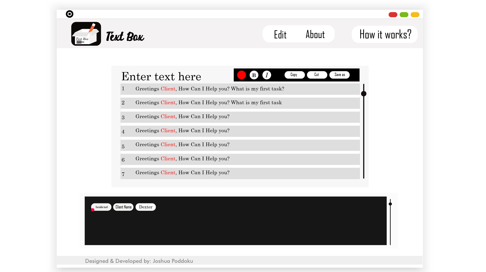

# Textbox

**A mobile first web-app, real-time tool which helps user to fasten his daily routine.**

''''
https://joshuapoddoku.github.io/TextBox  
'''''
Troubles you Face (not by using this :stuck_out_tongue:)
------------

Let’s see how..

When you write any formal message or email which has the same content but you have to change client name, salutation, references (for a particular receiver).
In a closer approach suppose you have typed an email of 60 lines and your client name is somewhere at line 32.
You would first search from the beginning and edit or make a note for every client.
And if you have to change 10 different words in 300 lines!!
It turns out to be a time elapser.

How can this be solved?
--------------------------------
This platform gives you a ease to declare or note as variable text when you start typing the text!
All these type of text fields which you want to edit for future use will be returned to editor’s dashboard and save them!

*Now no need to search for stuffs, they’ll be waiting for you in the dashboard itself!* :smile: 
In Short:
- User Friendly.
- Easier.
- Saves Time.

# MOCKUP

If you write a formal/informal message or mail to a client and you want to change the client name always for different clients. So instead of selecting the text area and typing always. Simply the dashboard (as seen in the mock-up) will help out . When you change the name as 'dexter' over there it'll update the 'client name' (which I've highlighted with red color).
You may wonder why do we need this dashboard and website itself for just changing the client name. Just imagine in case of 100 lines text and you've to change 30 different words which may include name, address, special greetings, and all common fields. One will take help of assistants!
**Note: You can select multiple words in dashboard**
